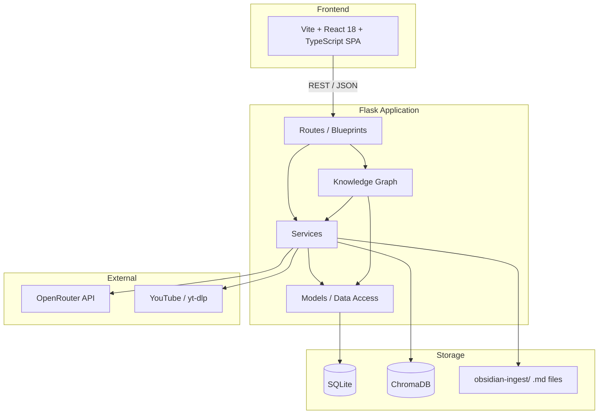
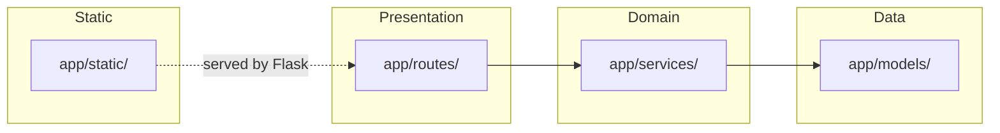
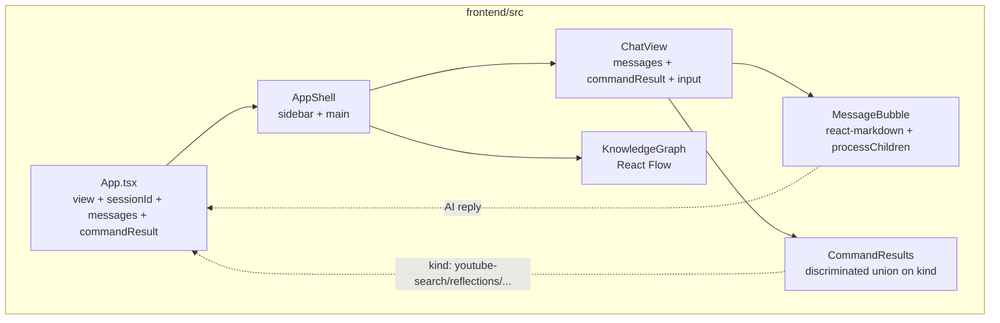
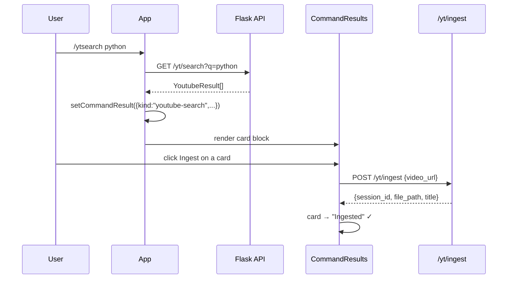
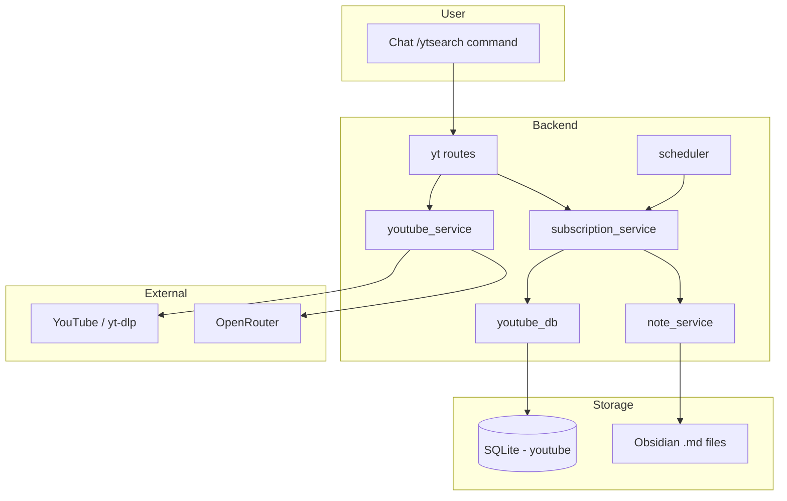
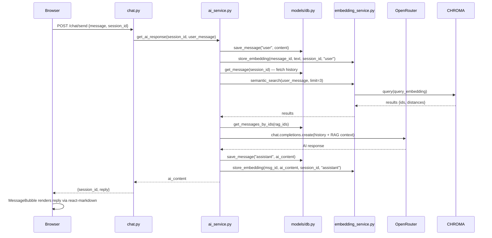

# Architecture

## High-Level Overview



The Vite build (`frontend/`) writes directly into `app/static/` with `base: "/static/"`, so Flask serves the React bundle as its own static files. There is no separate static server and no CDN at runtime.

## Clean Architecture Layering

The Python backend follows a strict layered architecture. Inner layers never import from outer layers.



### Layer Rules

| Layer | Path | Imports From |
|---|---|---|
| **Presentation** | `app/routes/` | Services, Flask |
| **Domain** | `app/services/` | Models, external APIs |
| **Data** | `app/models/` | SQLite only |
| **Static** | `app/static/` | Nothing (built by Vite, served as-is) |

## Frontend Architecture (React SPA)

The frontend is a single-page React app, not a multi-page site.



### Slash command rendering

`/ytsearch`, `/reflections`, `/reflection-today`, and `/kg*` are intercepted in `App.handleSend`. Each one calls the relevant API and stores the result in a typed `commandResult` slot instead of pushing a plain text message. `CommandResults` then switches on `result.kind` to render the appropriate card block.



### Markdown rendering

`MessageBubble.tsx` renders assistant messages through `ReactMarkdown` with `remark-gfm`. A `processChildren` helper walks string children of paragraph / list / heading elements and splits capitalized tokens (3+ chars) into clickable nodes that call `onNodeClick(label)` — opening the labeled concept in the knowledge graph. Inline `**bold**`, `*italic*`, `` `code` ``, links, tables, task lists, blockquotes, and strikethrough all render correctly.

### YouTube Ingestion



### Knowledge Graph

```mermaid
graph TB
    subgraph User_KG
        KG_CMD[/kg chat commands]
        GRAPH_VIEW[/kg in chat opens React Flow]
    end

    subgraph Backend_KG
        KR[kg routes]
        KS[kg_service]
        KDB[kg_db]
    end

    subgraph Storage_KG
        SQL_KG[(SQLite - entities, relationships)]
    end

    KG_CMD --> KR
    GRAPH_VIEW --> KR
    KR --> KS
    KS --> KDB
    KDB --> SQL_KG
```

## Data Flow: Chat Request



## Directory Structure

```
the-second-brain/
├── app/
│   ├── __init__.py           # Flask app factory
│   ├── config.py             # Env var loading (OpenRouter, YouTube)
│   ├── models/
│   │   ├── db.py             # SQLite connection + queries (messages)
│   │   ├── youtube_db.py     # SQLite layer (subscriptions, ingested_videos)
│   │   └── kg_db.py          # SQLite layer (entities, relationships)
│   ├── routes/
│   │   ├── chat.py           # Chat, sessions, search endpoints
│   │   ├── health.py         # Health check endpoint
│   │   ├── youtube.py        # YouTube ingestion & subscription endpoints
│   │   └── kg.py             # Knowledge Graph REST endpoints + /graph page
│   ├── services/
│   │   ├── ai_service.py     # LLM orchestration + RAG pipeline + lazy YT check
│   │   ├── embedding_service.py  # SentenceTransformer + ChromaDB
│   │   ├── youtube_service.py    # Transcript fetch, search, channel videos
│   │   ├── note_service.py       # De-bloat transcript → structured .md
│   │   ├── subscription_service.py  # Channel subscribe/unsub/auto-ingest
│   │   ├── scheduler.py       # APScheduler periodic subscription check
│   │   ├── memory_service.py     # (stub, unused)
│   │   └── kg_service.py     # KG entity/relationship CRUD + triple extraction
│   └── static/                # Vite build output (frontend/ → app/static/)
│       ├── index.html
│       └── assets/
│           ├── index-*.js    # bundle (react, react-markdown, reactflow, motion, ...)
│           └── index-*.css   # Tailwind v4
├── frontend/                  # Vite + React 18 + TypeScript source
│   ├── index.html
│   ├── package.json
│   ├── tsconfig.json
│   ├── vite.config.ts         # base: /static/, outDir: ../app/static
│   └── src/
│       ├── main.tsx
│       ├── App.tsx
│       ├── styles.css
│       ├── lib/               # api.ts, types.ts
│       └── components/
│           ├── layout/        # AppShell, Sidebar, PulseDivider
│           ├── chat/          # ChatView, MessageBubble, CommandResults, ...
│           ├── graph/         # KnowledgeGraph (React Flow)
│           └── ui/            # RippleButton
├── docs/                      # Documentation
├── tests/
│   ├── conftest.py            # Pytest fixture
│   ├── test_app.py            # Health + index route tests
│   ├── test_youtube_db.py     # 9 tests — subscription CRUD, dedup, ingested videos
│   ├── test_youtube_service.py # 12 tests — URL parsing, transcript, search
│   ├── test_note_service.py   # 4 tests — de-bloat, file save
│   ├── test_subscription_service.py # 5 tests — subscribe, check, ingest
│   ├── test_youtube_routes.py # 4 tests — HTTP endpoints
│   ├── e2e_youtube_manual.py  # Manual E2E (skips without API keys)
│   ├── test_kg_db.py          # 7 tests — entity/relationship CRUD, dedup, cascade
│   ├── test_kg_service.py     # 6 tests — service-layer CRUD, triple extraction
│   └── test_kg_routes.py      # 5 tests — HTTP endpoints
├── project_detailes/          # Planning documents
├── schema.sql                 # Reference schema
├── requirements.txt           # Python deps
└── run.py                     # Entry point
```

## Database Schema

### messages

| Column | Type | Description |
|---|---|---|
| `id` | INTEGER PK | Auto-incrementing ID |
| `session_id` | TEXT | UUID identifying a conversation |
| `role` | TEXT | `"user"` or `"assistant"` |
| `content` | TEXT | Message body |
| `created_at` | TEXT | Auto-set timestamp |

Index: `idx_messages_session_id` on `session_id`

### entities

| Column | Type | Description |
|---|---|---|
| `id` | INTEGER PK | Auto-incrementing ID |
| `name` | TEXT UNIQUE | Entity name (dedup via UNIQUE constraint) |
| `type` | TEXT | Entity type (e.g., concept, language, framework) |
| `description` | TEXT | Optional description |
| `created_at` | TEXT | Auto-set timestamp |

### relationships

| Column | Type | Description |
|---|---|---|
| `id` | INTEGER PK | Auto-incrementing ID |
| `source_entity_id` | INTEGER FK | References `entities(id)` ON DELETE CASCADE |
| `target_entity_id` | INTEGER FK | References `entities(id)` ON DELETE CASCADE |
| `relationship_type` | TEXT | Label for the edge |
| `weight` | REAL | Edge weight (default 1.0) |
| `created_at` | TEXT | Auto-set timestamp |

Indexes: `idx_rel_source`, `idx_rel_target`

## ChromaDB Schema

Collection: `messages`

| Field | Value |
|---|---|
| **Embedding model** | `all-MiniLM-L6-v2` (384 dimensions) |
| **ID** | Stringified message `id` from SQLite |
| **Metadata** | `{session_id, role}` |

## Design Decisions

| Decision | Rationale |
|---|---|
| **SQLite + ChromaDB dual storage** | SQLite for fast structured queries and history; ChromaDB for semantic vector search |
| **Embedding on every message** | Enables RAG across all past messages regardless of session |
| **RAG filters current session** | Avoids retrieving the same session's messages as context; only cross-session knowledge is injected |
| **Server-side session_id** | Generated by backend and returned to client, ensuring consistency |
| **Vite → app/static build** | A single `npm run build` from `frontend/` produces the bundle Flask serves on port 5000 — no separate static server, no CDN at runtime |
| **react-markdown for assistant replies** | Avoids custom parser bugs (malformed `**`, missed inline formatting) and handles GFM features (tables, task lists, strikethrough) for free |
| **Discriminated `CommandResult` union** | Every slash command returns a typed block; `CommandResults` switches on `kind` so each command's UI lives in one place |
| **React Flow for KG** | Interactive graph (zoom, pan, focus, expand 1-hop) out of the box; replaced the old vis.js page |
