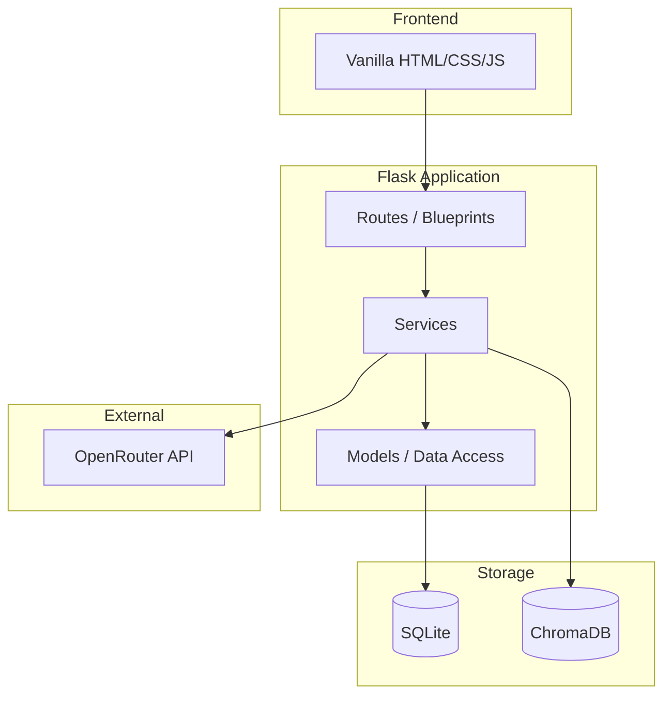
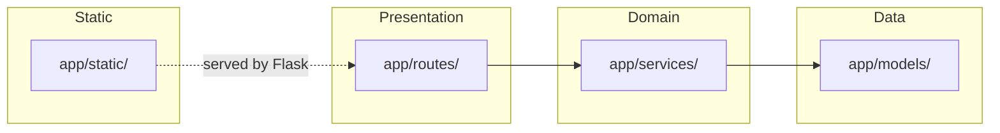
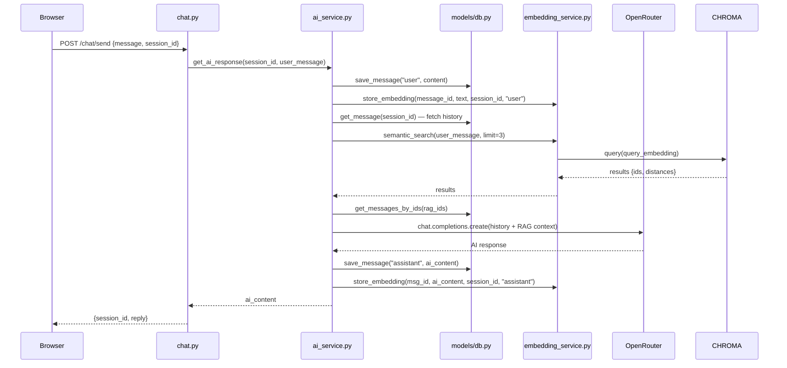

# Architecture

## High-Level Overview



## Clean Architecture Layering

The codebase follows a strict layered architecture. Inner layers never import from outer layers.



### Layer Rules

| Layer | Path | Imports From |
|---|---|---|
| **Presentation** | `app/routes/` | Services, Flask |
| **Domain** | `app/services/` | Models, external APIs |
| **Data** | `app/models/` | SQLite only |
| **Static** | `app/static/` | Nothing (served as-is) |

## Data Flow: Chat Request



## Directory Structure

```
the-second-brain/
├── app/
│   ├── __init__.py           # Flask app factory
│   ├── config.py             # Env var loading (OpenRouter)
│   ├── models/
│   │   ├── db.py             # SQLite connection + queries
│   ├── routes/
│   │   ├── chat.py           # Chat, sessions, search endpoints
│   │   └── health.py         # Health check endpoint
│   ├── services/
│   │   ├── ai_service.py     # LLM orchestration + RAG pipeline
│   │   ├── embedding_service.py  # SentenceTransformer + ChromaDB
│   │   └── memory_service.py     # (stub, unused)
│   └── static/
│       ├── index.html         # Chat UI
│       ├── style.css          # Styling
│       └── script.js          # Frontend logic
├── docs/                      # Documentation
├── tests/
│   ├── conftest.py            # Pytest fixture
│   └── test_app.py            # Health + index route tests
├── project_detailes/          # Planning documents
├── schema.sql                 # Reference schema
├── requirements.txt           # Python deps
└── run.py                     # Entry point
```

## Database Schema

### messages

| Column | Type | Description |
|---|---|---|
| `id` | INTEGER PK | Auto-incrementing ID |
| `session_id` | TEXT | UUID identifying a conversation |
| `role` | TEXT | `"user"` or `"assistant"` |
| `content` | TEXT | Message body |
| `created_at` | TEXT | Auto-set timestamp |

Index: `idx_messages_session_id` on `session_id`

## ChromaDB Schema

Collection: `messages`

| Field | Value |
|---|---|
| **Embedding model** | `all-MiniLM-L6-v2` (384 dimensions) |
| **ID** | Stringified message `id` from SQLite |
| **Metadata** | `{session_id, role}` |

## Design Decisions

| Decision | Rationale |
|---|---|
| **SQLite + ChromaDB dual storage** | SQLite for fast structured queries and history; ChromaDB for semantic vector search |
| **Embedding on every message** | Enables RAG across all past messages regardless of session |
| **RAG filters current session** | Avoids retrieving the same session's messages as context; only cross-session knowledge is injected |
| **Server-side session_id** | Generated by backend and returned to client, ensuring consistency |
| **Vanilla JS frontend** | Minimal dependencies for MVP; framework migration planned for later phases |
